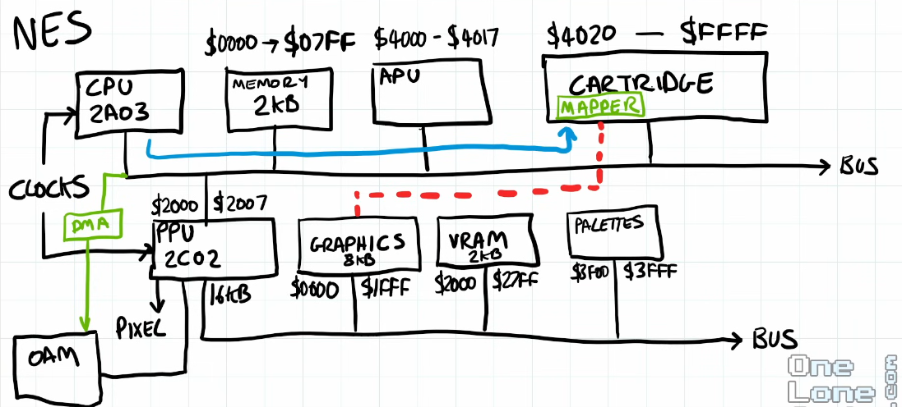
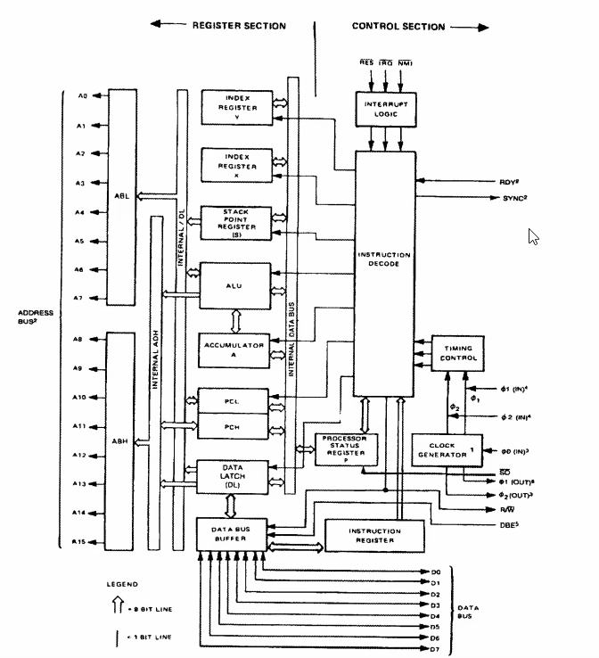
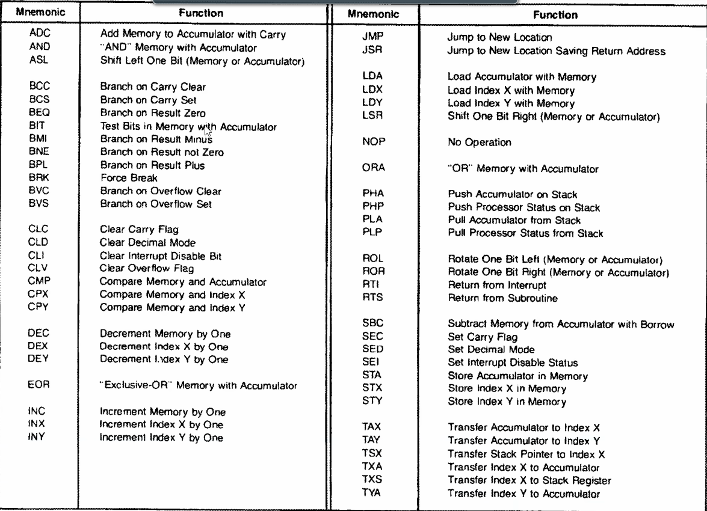
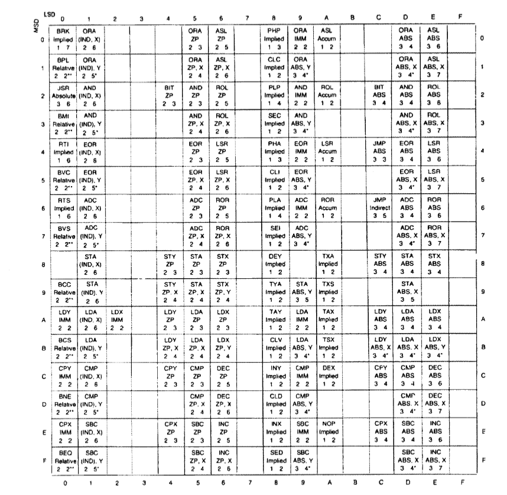
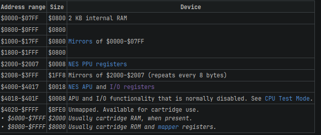

# NES Emulator
#### Binary and Hexadecimal
Hexadecimal is just binary numbers where 4 bits are categorically defined into base-16 numbers like 0-9-A-F. 
#### Bitwise Operations
- We use binary numbers because they can be used to set certian operations/switches. 
- We can use AND & to extract a certain bit.
- We can use OR | ~ to set a bit. 
- we can use Invert ~ to clear a certain bit.
- Left Shift << and Right Shift >> can be used to target a certain bit. Left Shift multiplies by 2 and Right Shift Divides by 2.
- Use XOR ^ for toggling a certain bit.
#### Bitfields
```C++
Union {
    struct {
        char unused:1;
        char sw2:1;
        char sw1:1;
        char state:2;
        char value:3;
    }
    char reg;
}
// Now we can use commands as follows to assign values to bits

// A.value = 4
// A.sw2 = 0

// A.reg=0x00
```

### NES internal construction



### CPU [6502]
```
6502
    A: Accumulator ---
    X: Register      | 8bit 
    Y: Register    __|
    stkp: Stack Pointer -->8bit
    pc: Program Counter --> 16bit [Next address]
    status: Status register ---> States of the CPU[Last Result==0, Carry Operation!?, En/Dis Interrupts]

```

- The 6502 cannot be emulated by a simple process of incrementing PC, fetching Byte Instruction and output result at every clock cycle.
- Instructions can be 1-3 bytes and each instruction can take several clock cycles.
- Therefore we need to be concerened with the size and duration of the instruction. There are 56 total instructions for the 6502.
#### Instructions
We need to emulate the following for each instruction:

```
Instruction --> Function + Addressing Mode + Clock Cycles
```



##### Steps for each instruction:
1. Read a Byte @PC
2. OPCODE[BYTE] --> Addressing Mode + Cycles
3. Read Remaining Intruction Bytes
4. Execute
5. Wait/Count Cycles


#### Implementation
##### Bus
- A bus would require basic read and write protocols that can be used by the cpu to read and write to memory. It would also require clock and reset signals.
- A cartridge is inserted to the bus so that functionality would also be defined here. Similiarily lets add 2kB of RAM as an array for basic simulation.
###### Features
- 16 bit Addressing
- 2kB RAM
- 8 bit Data    

##### CPU
- Status Registers, Core registers and basic interrupts.
- Bus connection Function
- Flag toggling functions
- Address, cpu cycles, opcodes, fetched data and temp data variables for funrther usage.
- Read, Write and fetch functions
- Instruction structure that whould consist of opcode, addressing mode and cycles required for execution
- Instruction lookup table
- Addressing modes Definition
- Opcode definition

###### Features
- 6 core registers
- 56 valid instructions
- 12 addressing modes

###### Memorymap



- $0000-$00FF = Zero Page
- $0100-$01FF = System Stack
- $FFFA-$FFFF = Non-maskable interrupt handler/ Reset/ Interrupt Request Handler
